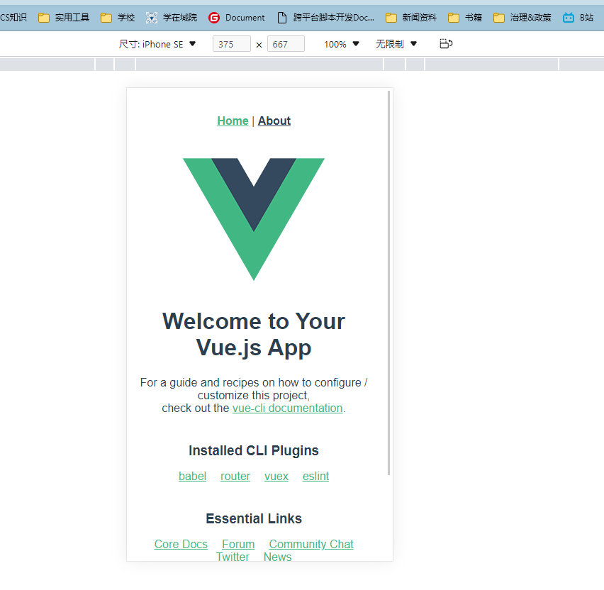
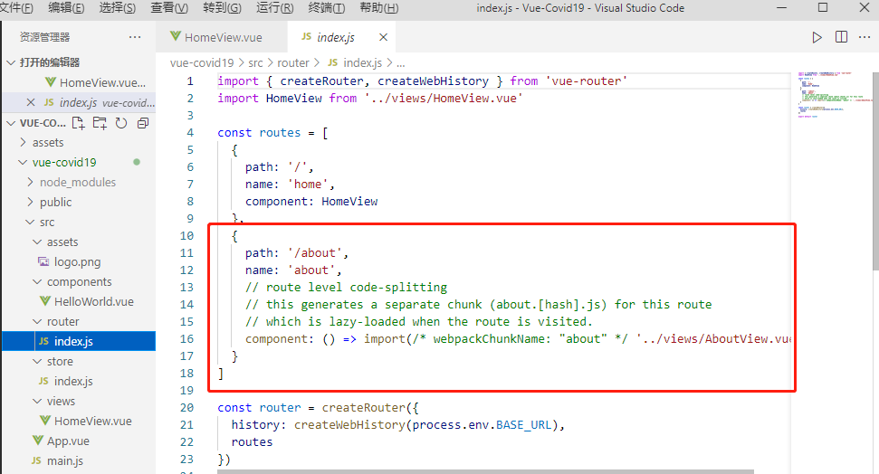
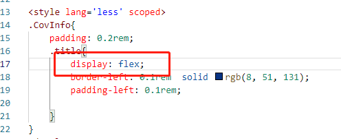
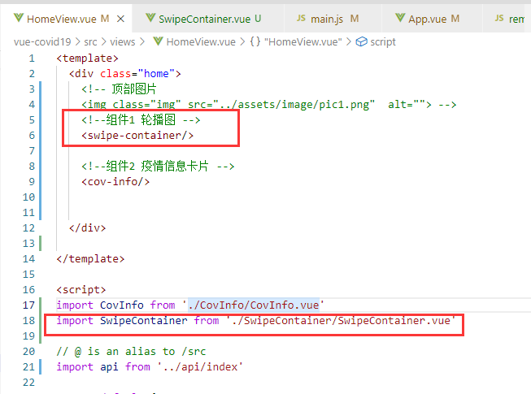
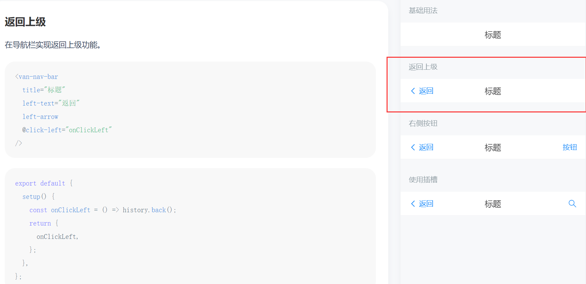
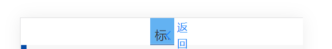
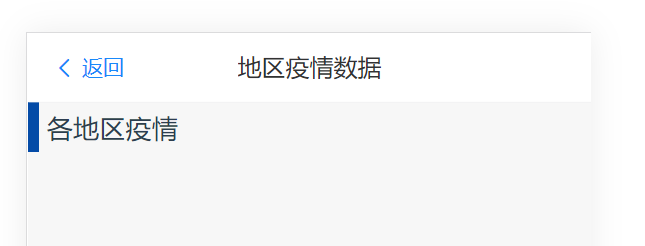
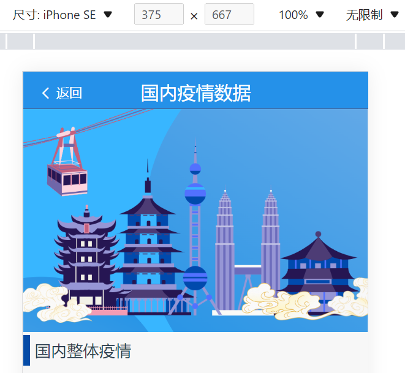
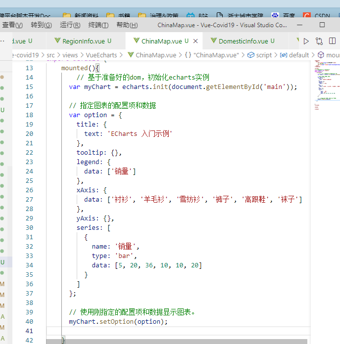
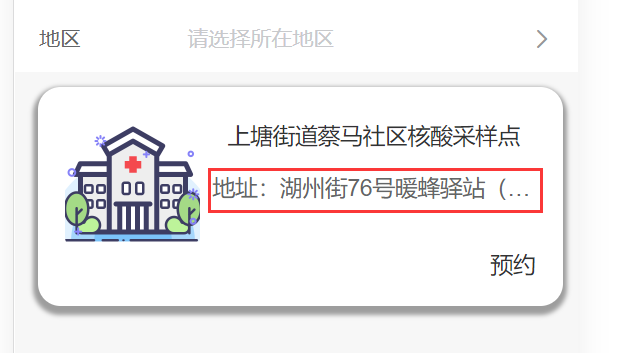

#  疫情通vue项目

    这是一个移动端的疫情数据信息介绍项目，在模仿丁香医生的基础上进行改进。

班级：计算机1902

姓名：潘禹均

学号：31901048

## 1. 技术点

1.组件
2.网络请求axios
3.vue中使用echarts
4.vue中封装的tabs组件~自定义封装组件

## 2. 项目创建及其初始化

命令行：vue create vue-covid19

### 试运行

可以看到vue的初始界面

### 安装axios

### 安装vant

#### *注意点：因为之前装了vant3后又装了vant2，因此配置环境需要重复之前的历程

npm i vant   ->    npm i vant@latest  -> npm i vant@latest-v2 -S    ->npm uninstall vant   ->   npm i vant 

(不知道为什么会这样)

根据vant指南，进行操作

### 删除不必要的组件

查看效果

###  

### 初始化css

方式1：在app.vue中引用公共初始化css

方式2：在main.js中引入初试css

以上2种方式，2选1就好。

## 3. 移动端适配

资料：[手机端页面自适应：rem布局_axl234的技术博客_51CTO博客](https://blog.51cto.com/u_15581727/5177771) 

引用rem.js，自动适配

## 4. 界面1 首页

首先加入自己设计的图片，作为首页封面

在home.vue中应用

效果如下：

#### 问题1 直接在 img处设置width为100%，图片消失？

当我把width设为100%时，出现了问题

在代码中设置为100%，实际运行中却是0，这是为什么？

##### 解决方案：设置一个名img为class的类，通过style里面设置img的width来解决问题。

### 首页基本信息

#### 标题

建立组件1 CovInfo.vue

在HomeView.vue里面引入该组件

此时存在一个问题：实际效果的标题总是居中

后来在CovInfo.vue里面的css，.title的地方加上了 display：flex;

问题解决：

#### 处理接口地址

疫情数据接口：http://api.tianapi.com/ncov/index?key=e5c7988b3c46963eb8d8f3a13db36d9e

此时配置一个公共的接口文档

在src下新建文件夹 api

其中，base.js 中放的是公共请求的接口

index.js中写的是请求方法，接下来的操作以此类推

#### 在HomeView.vue中尝试获取数据

在控制台查看

#### 尝试轮播图

####问题2：想实现三个轮播图，但是现在三个图却显示在了一个界面上？

05.18

#####解决：安装插件并设置轮播图的css样式

设置 display:inline-block

### 组件1：轮播图组件

将轮播图作为一个组件来封装

由于命名swipe会出错，因此文件夹和文件名称都改为SwiperContainer，驼峰写法。

#### 问题3：navbar顶部导航栏，文字不能在同一行的问题

按照vant手册，应该是

但是，实际情况是：

##### 解决方案：因为没有安装插件

安装插件后，还是有问题

后来，发现原因在于，vant引用后，不需要自己写样式。

给样式注解掉之后，问题解决

### 组件2： NavBar 组件

每个界面都有自己对应的NavBar

下面以首页的Navbar为例

效果如下：

其他界面 多了返回按钮，其他都基本一致

效果如下:

### 组件3： TabBar组件

在每个界面的底部，也存在着导航栏

以首页为例

查阅 vant组件库资料：

引用该组件：

#### 对TabBar里面的图标进行更换

首先去iconfont阿里巴巴矢量图标库，将需要的图标添加到该项目

点击 ”下载至本地“

将文件夹中的文件复制到

项目对应的文件下：

之后在代码中应用

## 5. echarts安装

### echarts安装

命令：cnpm i echarts@4.x -S

安装4.x版本，有利于用地图

在view里面建立 VueEcharts文件夹，里面新建文件 ChinaMap.vue，用来写中国国内疫情地图

根据ECHARTS官方文档，快速入门的方式，来写：

在DomesticInfo.vue里面引入 ChinaMap组件

在 ChinaMap.vue文件中尝试官方文档，建立一个简单的图

 

#### 折线图

## 核酸检测点查询界面

### vant card的使用

#### 问题：desc太长显示不全

##### 解决方案：改用template

通过h4，来加粗采样点名称

#### 问题：打开界面不显示顶部，而是显示在中部或者底部

##### 解决方案：在js中加入代码

打开后，显示在顶部

## 打包移动端

用Hbuilder打包

### 注意点：

1.不能用history模式，需要改为hash

2.在vue.config.js中配置

3结果

存在一些小问题，基本满意。

### 问题：iconfont在app中显示异常

根据官方文档的解决方案：[uni-app官网 (dcloud.io)](https://uniapp.dcloud.io/matter.html) 

原来的css

修改后：

## 新闻界面

### 图片设计

放入轮播图效果

