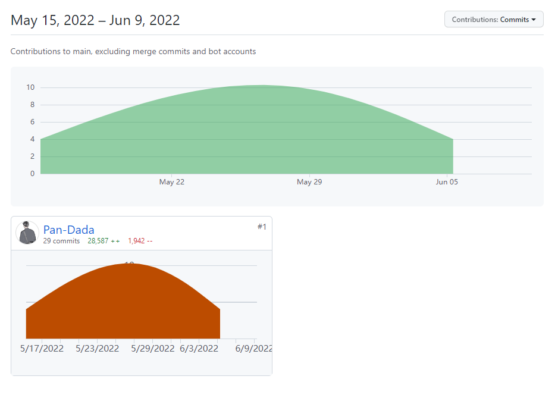
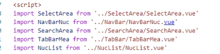
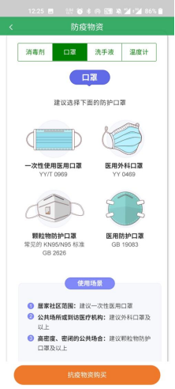
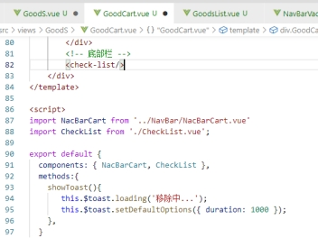
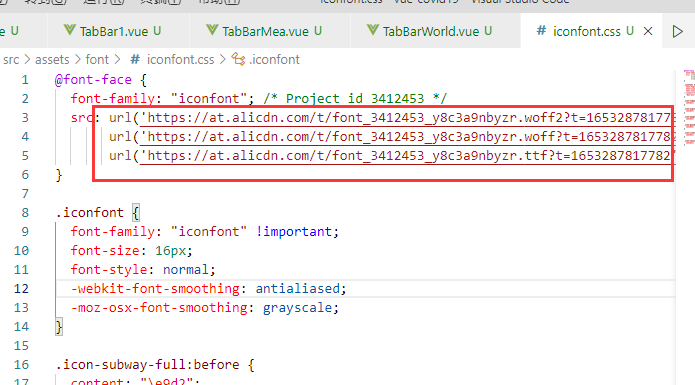

# 2021-2022学年第2学期
# **实 验 报 告**


- 课程名称:跨平台脚本开发技术  
- 实验项目:  期末大作业
- 专业班级_计算机1902__                      
- 学生学号_31901048__
- 学生姓名_潘禹均__
- 实验指导教师:郭鸣

## 实验内容

## 一、项目分工和自我评估

1. 项目分工表格

   | 姓名   |   学号   |       班级 | 任务 | 权重 |
   | :----- | :------: | ---------: | ---: | ---: |
   | 潘禹均 | 31901048 | 计算机1902 | 全部 |  1.0 |

2. 项目自我评估表

   | 技术点           | 自评等级:(1-5) | 备注                                                         |
   | :--------------- | :------------: | ------------------------------------------------------------ |
   | Vue框架          |       5        | 一套用于构建用户界面的渐进式JavaScript框架 ， 采用自底向上增量开发的设计 ，用于前端。 |
   | express 框架     |       4        | 一个简洁而灵活的 [node.js](https://baike.baidu.com/item/node.js/7567977) [Web应用框架](https://baike.baidu.com/item/Web%E5%BA%94%E7%94%A8%E6%A1%86%E6%9E%B6/4262233) ，用于后端。 |
   | 响应式编程       |       5        | Vue 最独特的特性之一，是其非侵入性的响应式系统。             |
   | 函数式编程       |       3        | 函数作为参数、对象来传递数据。                               |
   | Axios            |       4        | 这是一个基于promise的网络请求库，作用于[node.js](https://baike.baidu.com/item/node.js/7567977)和[浏览器](https://baike.baidu.com/item/%E6%B5%8F%E8%A7%88%E5%99%A8/213911)中 |
   | vant3            |       5        | 组件化开发，让开发更加高效。                                 |
   | MySQL            |       4        | 用于后端数据管理                                             |
   | Docker           |       3        | 用于服务器部署数据库                                         |
   | 应用跨平台的适配 |       4        | 通过rem.js文件，使得应用可以根据设备来自适应调节             |
   | body-parser      |       4        | Node.js 正文解析中间件 ， 在处理程序之前在中间件中解析传入的请求主体，在`req.body`属性下可用。 |

## 二、项目说明和整体评估


1. **项目说明**：该项目由本人独立开发完成，包括前端页面的所有图片内容均为原创设计。

     

1. **项目整体评分（1-5）**：4

1. **项目上传日志**：

   

   4.**GitHub地址**：[Pan-Dada/vue-covid19 (github.com)](https://github.com/Pan-Dada/vue-covid19) 
## 三、作品主题和内容设计

### 1. **作品主题**

古往今来，疫情的突发往往会导致国家和社会损失惨重。 2003年非典疫情的爆发，以及 2020年初爆发的新型冠状病毒肺炎（COVID-19）疫情，都给人民的生命安全和经济发展都带来了严重影响。得益于我国政府的有效把控，我国的疫情得到了有效控制，但我们每个人仍然不能松懈。疫情防控，人人有责。

本次移动应用设计课我设计出了一个移动应用，用于疫情防控相关的各种数据查询，新闻资讯，以及面对疫情各种对应措施的应用。让用户通过一个轻型app就可以轻松应对疫情防控的各方面问题，同时获取实时信息咨询，做到有效防控。

### 2. **内容设计**

移动应用名称：疫情通

移动应用logo：

 

logo设计：采用防疫主力医生画像作为图案，加上当下疫情的社会背景，让人很容易知道这是一款防疫软件。上面的英文字符WAR AGAINST COVID19更是清晰地表明了这款软件的作用。下面小字 An efficient anti-epidemic tool 更是进一步解释了该应用的重要性。

 

在内容方面，本次的移动应用大体可以分为两个方向的内容：1.疫情相关信息数据的查询。2.应对疫情的各项措施应用。

在第一个信息数据查询方向，我分为了以下几个模块：1.疫情通的首页。

2.国内外疫情热点。3.国内疫情数据及图表。4.全球疫情数据及图表。

在第二个疫情防控措施方向，我分为了以下几个模块：1.防疫措施首页。2.疫苗接种情况。3.核酸检测点查询。4.防疫出行指南。5.防疫物资介绍。6.防疫物资购买。

### **3. 思维导图**


## 四、每个页面设计、实现及其框架

### **0.应用启动页面**

 

#### **0.1设计介绍**

应用的启动动画采用全屏的方式，设置过渡时间为1500ms，让用户在刚打开应用时看到“抗击疫情，人人有责”八个字，对该应用有了初步的印象。同时，该界面图象呼应了应用的logo，不会让人感觉突兀，具有协调美。

#### **0.2实现框架**

在Hbuilder的	manifest.json中设置

 

 

 

 

 

 

 

### 1. **用户登陆注册，个人中心页面**

        

#### **1.1设计介绍**

登录界面的色彩主题和该app的整体主题一致，都是蓝色。输入账号密码就可以登录。

注册界面也同样为蓝色调，填写的资料为：账号，密码，用户昵称，手机号和地址。在注册时候会对手机号进行判断，如果手机号的格式不对，则无法注册成功。同时对注册的字段进行检查，如果没有填写完整，则同样无法成功注册。

注册用户是对后端数据库中的内容进行增加。登录功能，是对后端数据库里面的内容进行查询并比对密码来判断能否登录成功。

个人中心页面可以对个人数据进行修改，即对后端数据库进行修改。还可以注销用户，即对数据库中的记录进行删除。点击“退出登录”返回到登陆界面，可以登录其他账号。

 

     

如上图，在注册时进行检查。

 

个人页面资料显示如下：

点击头像可以上传自己的头像，同时可以修改用户名，电话，地址。

      

后端数据库：

 


★头像上传功能：

选择要上传的头像


选择后上传成功：


上传后在数据库查看：


在复制url后在浏览器中打开：


#### **1.2实现框架**（后端技术）

前端：登录注册和个人资料页面都用了vant中的Form，submitbar，上传头像用了uploder组件。

 

 

 

 

后端：用了express框架，自己写了server，通过axios来传递数据。

db.js为数据库信息

 

index.js为配置文件


 


userApi.js为操作的具体实现，包括了连接数据库和增删改查。

 

 

输出函数

 

 

增加个人信息数据：

 

 

查询ge数据:

 

 

修改个人信息数据：

 

 

删除个人信息数据：

 

 

添加上传图片信息：


后端使用方式:node index.js

 

 

 

 

 

### 2. **“疫情通”首页**

#### **2.1设计介绍**

首页采用了卡片式的设计，每个卡片上都有大字体来提示对应卡片所拥有的功能，给人们一种简洁明了的体验。用户可以直接点击卡片，跳转到卡片上文字所对应的页面。

     

#### **2.2实现框架**

顶部状态栏显示“疫情通”，采用了vant3中的NavBar，表明该应用的名称。

往下是轮播图，采用了vant3中的swipe，轮播三张图，间隔时间2000ms。

再往下是信息导览，包含四张卡片，采用了vue的img并对其的css进行调整，体现出阴影和圆角。四张分别是：“疫情热点新闻”，“国内疫情”，“海外疫情”，“防疫措施”。

最底下是底部导航栏 ，包含了四个界面，分别是首页，国内，全球，措施，通过router进行跳转。

该页面包含4个组件，具体如下：

 

 


### **3.疫情热点资讯页面**

     

#### **3.1设计介绍**

新闻资讯界面，除了顶部和底部导航栏，主要分为2个模块：1.轮播图。2.新闻卡片列表。

轮播图轮播热点新闻，下面的热点新闻榜展示了当前有关疫情的热门新闻，点击后可以跳转到具体的新闻内容。

新闻卡片采用长方形设计，附加阴影、富有立体感。卡片上面的文字采用大字体，让用户使用起来十分轻松，简洁明了。

 

#### **3.2实现框架**

在NewsInfo.vue界面引用了四个组件，具体如下图。其中，新闻轮播图采用了vant3中的swipe，新闻排行榜则是用了vue中的img，并调节css。

 

 

 

 

 

 

### **4.具体新闻页面**

 

 

     

 

#### **4.1设计介绍**

新闻的具体界面,包含了文字和图片,图文并茂。在文章的最下方,包含了对文字的打星点评以及相关推荐功能。

 

#### **4.2实现框架**

该界面新闻主题由文字和图片组成。

文章包含了大标题,发布方,时间,正文,编辑.通过div,img,h1,h3,p来实现。

下面用van-rate来显示推荐指数,进行打星。

再下面的相关推荐,则与新闻排行榜一样,采用了卡片设计。

 

 

 

 

 

### 5. **国内疫情页面**

     

 

#### **5.1设计介绍**

该界面除去顶部底部栏,可以分为三个模块: 1.插图  2.全国数据统计面板3.国内疫情地图。

插图采用蓝色调,与顶部栏以及该app的信息模块相呼应,具有协调美。

全国数据统计板块,包含了:现存确诊,累计确诊,境外输入,无症状患者,累计死亡,累计治愈六个数据。

再往下是用了echarts的地图。通过图中颜色的深浅可以轻易的看出各区域的疫情状况，点击图片上的板块，还可以查看具体区域的数据。左右滑动还能切换查看现存确诊数和累计确诊数。（如下图）

 

 

     

#### **5.2实现框架**

 

 

顶部底部栏通过组件引入。

 

封面采用了vue中的img，再通过css进行调整。

统计板块的数据采用了api接口来获取。

 

 

通过函数处理获取的数据

 

 

### 6. **全球疫情页面**

#### **6.1设计介绍**

设计方式与国内疫情页面相似，该界面除去顶部底部栏,可以分为三个模块: 1.插图  2.全球数据统计面板3.全球疫情地图。

插图采用蓝色调,与顶部栏以及该app的信息模块相呼应,具有协调美。

全国数据统计板块,包含了:现存确诊,累计确诊,累计死亡,累计治愈六个数据。

再往下是用了echarts的地图。通过图中颜色的深浅可以轻易的看出各区域的疫情状况，点击图片上的板块，还可以查看具体区域的数据。左右滑动还能切换查看现存确诊数和累计确诊数。（如下图）

 

     

 

 

 

#### **6.2实现框架**

 

顶部底部栏通过组件引入。

 

插图采用vue的img，并用css进行调节。

统计板块的数据采用了api接口来获取。

 

 

### 7. **防疫措施首页**

#### **7.1设计介绍**

首页采用了卡片式的设计，每个卡片上都有大字体来提示对应卡片所拥有的功能，给人们一种简洁明了的体验。用户可以直接点击卡片，跳转到卡片上文字所对应的页面。

     

#### **7.2实现框架**

顶部状态栏显示“疫情政策措施”，采用了vant3中的NavBar，表明了该模块的名称。

往下是插图图，采用了vue中的img，再通过css进行调整。

再往下是信息导览，包含四张卡片，采用了vue的img并对其的css进行调整，体现出阴影和圆角。四张分别是：“疫苗接种情况”，“核酸检测点查询”，“出行指南”，“防疫物资”。

最底下是底部导航栏 ，包含了四个界面，分别是首页，国内，全球，措施，通过router进行跳转。

措施首页：

 

 

卡片组件：

 

 

### 8. **疫苗接种情况页面**

#### **8.1设计介绍**

该界面除去顶部底部栏，大体分为4块：1.插图。2.文字滚动条。3.疫情接种情况统计面板。4.疫苗相关图表。

插图和文字滚动条主要起到了宣传的作用，鼓励用户及时去接种疫苗。统计面板和图表则直观地体现了我国和全球的疫苗接种情况。

统计板块则用四种不同颜色的数字来展示当前的疫苗接种情况，同时还与昨日进行对比。

图表用柱状图和折线图。柱状图对比了我国和全球的每百人疫苗接种数，通过对比可以发现我国疫苗的接种率之高。折线图横坐标为世界，纵坐标为疫苗接种情况，体现了我国疫苗的接种趋势。

 

    

 

#### **8.2实现框架**

图表通过组件来引入

 

 

数据通过api获取

 

通过函数来处理数据：

 

echarts:

 

 

 

 

图表样式（柱状图为例）：

 

### 9. **核酸检测点查询**

#### **9.1设计介绍**

除了顶部底部栏，该页面包含了插图，城市选择，关键词搜索，监测点列表四个部分。

     

 

插图用于介绍该页面的作用。

关键词查询，可以查询到特定的某个监测点。

选择地区，可以根据地区来寻找监测点。

检测点列表中显示了检测点名称，检测点地址以及工作时间。点击“预约”按钮后，会有个加载的toast，可以模拟跳转到预约页面。

 

 

#### **9.2实现框架**

 

 

 

顶部底部栏引用了vant3的navbar和tabbar组件。

插图用了vue中的img，并调节css。

搜索框则用了vant3中的search组件。

城市选择则引用了vant3中的Cascader级联组件。

检测点列表通过vant3中的card来调节获得。

跳转时的加载，采用了vant3中的toast。

 

搜索框：

 

城市选择：

 

 

检测点列表：

 

 

跳转加载：

 

 

 

 

 

### **10.出行指南页面**

#### **10.1设计介绍**

该页面除去顶部底部栏，主要有三个模块：插图，文字滚动条，出行防护小贴士。

插图表明了该页面的作用。

文字滚动条为宣传语，鼓励人们按照出行防疫指南中的要求来执行，可以减少在出行时感染疫情的几率。

出行防护贴士，给出了四种交通工具的要求，每种交通工具都有其自己的具体要求。用户通过左右滑动，就可切换交通工具。

 

     

 

 

 

#### **10.2实现框架**

插图用vue的img，并调节css。

宣传语用了vant3中的Noticebar，作为组件引入到TracelPolicy.vue中。

出行防疫小贴士，用了vant3中的tab。

 

 

数据写在js文件中，再导入到vue文件

 

 

 

 

### **11.防疫物资页面**

#### **11.1设计介绍**

     

 

该页面，除了顶部底部栏，包含了插图，文字滚动条和防疫物资介绍图文，购买按钮。

 

插图直接明了地展示了该界面的内容为防疫物资的介绍。

 

文字滚动条为宣传语，鼓励用户利用防护物资做好防护。

 

图文介绍，主要介绍了消毒剂，口罩，洗手液，温度计4样物资。

 

最下面的按钮，用于购买物资，点击后会跳转到防疫物资商场。

 

 

#### **11.2实现框架**

 

 

 

插图用了vue中的img并通过css进行调节。

图文介绍用了vant3中的tab来展示，通过左右滑动，可以切换商品的类别。

购买按钮为vue中的button，并通过router跳转，点击后可以跳转到购买物资的界面。

### **12.防疫物资购买页面**

#### **12.1设计介绍**

     

 

在刚从上个页面进入时候，有个toast用于加载，体现了动画过渡效果。

该页面，除了顶部栏，共有4个模块：关键词搜索，物品筛选，商品列表，以及底部的购物车入口。

关键词搜索，实现输入关键词就可得到想要物品的内容。

物品筛选，可以根据需要，来筛选出不同类别的物品。

商品列表，采用了卡片式设计，直观地体现了各个商品，用户可以点击购物车先将物品加入购物车，也可点击购买直接进行购买，点击后均有toast反馈。

点击底部栏的购物车，就可以进入购物车页面。

 

#### **12.2实现框架**

 

顶部栏采用了vant3中的NavBar。

搜索框用了vant3中的search。

选择栏则用了vant3中的DropdownMenu下拉菜单。

商品列表每个商品为一个Item，通过vant3中的card调整css样式而来。

底部栏则是用了vant3的TabBar。

 

 

 

### **13.购物车页面**

#### **13.1设计介绍**

      

 

该页面除去顶部栏,共有三个模块,顶部搜索栏,中间商品列表,底部的订单提交栏。

搜索栏，可以方便地搜索购物车中包含关键词的物品，有利于筛选。

点击“从购物车移除”按钮，可以将不需要的物品移除，点击后会有toast的加载，显示为“移除中...”，模拟了移除购物车的操作。

底部栏，显示了购物车中商品的总价格。点击“提交订单”按钮后，会有toast的加载，显示“提交订单中...”，模拟了提交订单的操作。

 

#### **13.2实现框架**

 

 

顶部栏采用了vant3中的NavBar，并修改css样式得到。

搜索框采用了vant3中的search，并修改css样式得到。

购物车列表中的每一个Item则用vant3中的card修改而成。

底部栏采用了vant3中的SubmitBar，修改css样式得到。


  


1. 解决技术要点说明
    - 解决数据传递问题， 关键代码与步骤如下

      

    - 解决 xxx 问题2， 关键代码与步骤如下

      

1. 心得体会（结合自己情况具体说明）

     - 大项目开发过程心得
        - 遇到哪些困难，经历哪里过程，有哪些收获


## 五、问题解决及技术要点

#### 技术要点：实现多设备自适应

通过整体引用rem.js，实现设备自适应功能。


代码如下：

```js

```


#### 问题1：用通过$route.push的[params](https://so.csdn.net/so/search?q=params&spm=1001.2101.3001.7020)传参，刷新页面后参数会丢失。

每次刷新首页后，登陆时候的id会丢失，只能出现一次。

##### 解决方案：改用query来传参数


学习参考：[Vue路由传参及传参后刷新导致参数消失处理 - 走看看 (zoukankan.com)](http://t.zoukankan.com/matd-p-11576696.html) 

原来：


修改后：


获取数据：


刷新页面后，发现userid不会丢失。


#### 问题2：图片上传出现 413 (Payload Too Large)的报错


##### 解决方案：修改server里面的index.js配置文件

添加如下代码：


新增`limit: '10000kb'`，系统默认大小为100kb，而刚才上传的图片大小为120kb，超过了系统默认的大小限制，需要手动修改限制。


#### 问题3：直接在 img处设置width为100%，图片消失？

当我把width设为100%时，出现了问题


在代码中设置为100%，实际运行中却是0，这是为什么？

##### 解决方案：设置一个名img为class的类，通过style里面设置img的width来解决问题。


#### 问题4：iconfont在移动端app中显示异常


##### 解决方案：根据uni-app官网修改css样式

根据官方文档的解决方案：[uni-app官网 (dcloud.io)](https://uniapp.dcloud.io/matter.html) 


原来的css


修改后：




#### 问题5：desc太长显示不全


##### 解决方案：改用template


通过h4，来加粗采样点名称


#### 问题6：打开界面不显示顶部，而是显示在中部或者底部。


例如，打开核酸检测点查询界面，不会显示在最顶端，而是从中间开始显示。

##### 解决方案：在JavaScript部分添加windows.srollTo(0,0)


再次进入界面，发现从最顶端开始浏览。


## 六、个人心得

​	很早之前就听说过开发软件分为前端、后端之类的话术，但始终对前后端没有特别深刻的理解。在学习了这门课程之后，我对前后端有了更深刻的理解。

​	我认为vue3是一个非常好的前端框架。一个vue文件中包含了template，js，css。每一部分都包含了自己的作用，分工明确，逻辑上十分清晰，在开发的时候也会更容易理解。如果需要调节样式，只要调整css中的参数即可；如果要用到函数，只需要在js中进行定义就可以，十分方便。通过rem.js的设置并引用，可以实现自适应，可以让开发的软件在不同的设备中都可以使用。

​	同时，我认为express也是一个比较容易上手的后端框架。Express 是一个简洁而灵活的 node.js Web应用框架, 提供了一系列强大特性帮助你创建各种 Web 应用，和丰富的 HTTP 工具。它具备了一下几个优点：

- 可以设置中间件来响应 HTTP 请求。
- 定义了路由表用于执行不同的 HTTP 请求动作。
- 可以通过向模板传递参数来动态渲染 HTML 页面。

		课程中，老师主要是给我们讲解了JavaScript的一些原理性的东西，帮助我们理解JavaScript的本质。可以让我们在开发过程中，遇到了困难时候有了更多的解决思路。

		我认为这是一门非常有意思的课程，这门课程可以非常好地锻炼我们的创新能力，因为通过自己动手来设计出一个自己制作的软件是一件非常有成就感的事情。最开始，可能会因为选择主题而苦恼，但是当选定主题、开始开发后，思绪便开始蔓延。有时候晚上因为有了新的想法而熬夜在写自己的项目，有几次为了及时把自己的想法付诸实践，不知不觉写到了天亮了。虽然很累，但很有意义。
		
		通过这门课程，让我清楚了自己在软件开发领域的爱好，我知道自己在前后端的选择上，应该会更喜欢前端。前端设计对我来说是一件具有创造力的事情，会让我深刻地感受到设计的成就感。


## 七、课程建议

​	难度适中，主要是课本的内容比较多，进度有点快，原理性的东西短时间内无法很好地接受。课程内容以原理性的内容为主，我认为可以适当添加些应用性的内容，老师通过带领我们学习完成一个小的项目，让我们更加深入地理解课堂上所学的内容。这样子，我们期末完成自己的大作业的时候，会有个循序渐进的过程，也会让我们更好地完成作业。